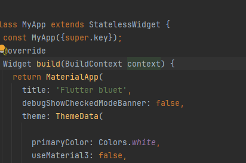
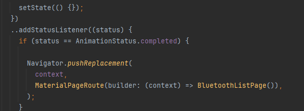

# bluet

create new projet flutter name is Bluet .

## create  class animantionPage for introdution page
 1.dependence: flutter_native_splash
 2. 
 3. creer dossier images => logo.png
4. navigation 

### rediger dans la page List bluetooth 
pourlister tout les appareils connecter
    1. dependence : flutter_bluetooth_serial

    

